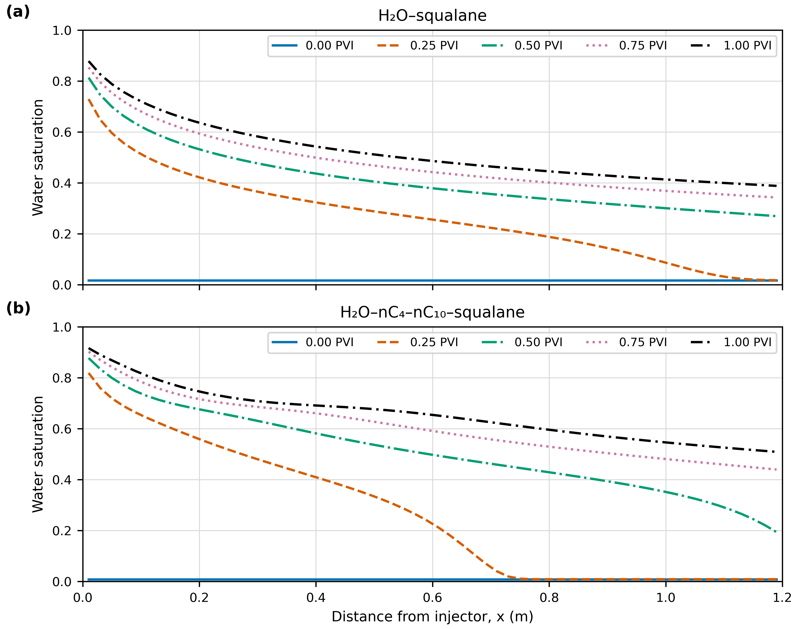
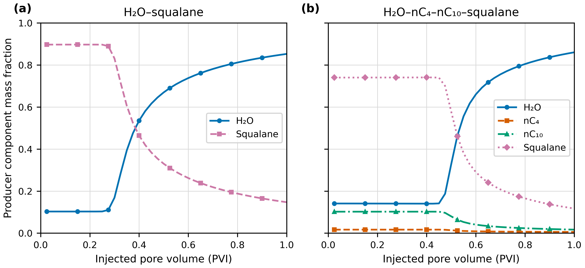
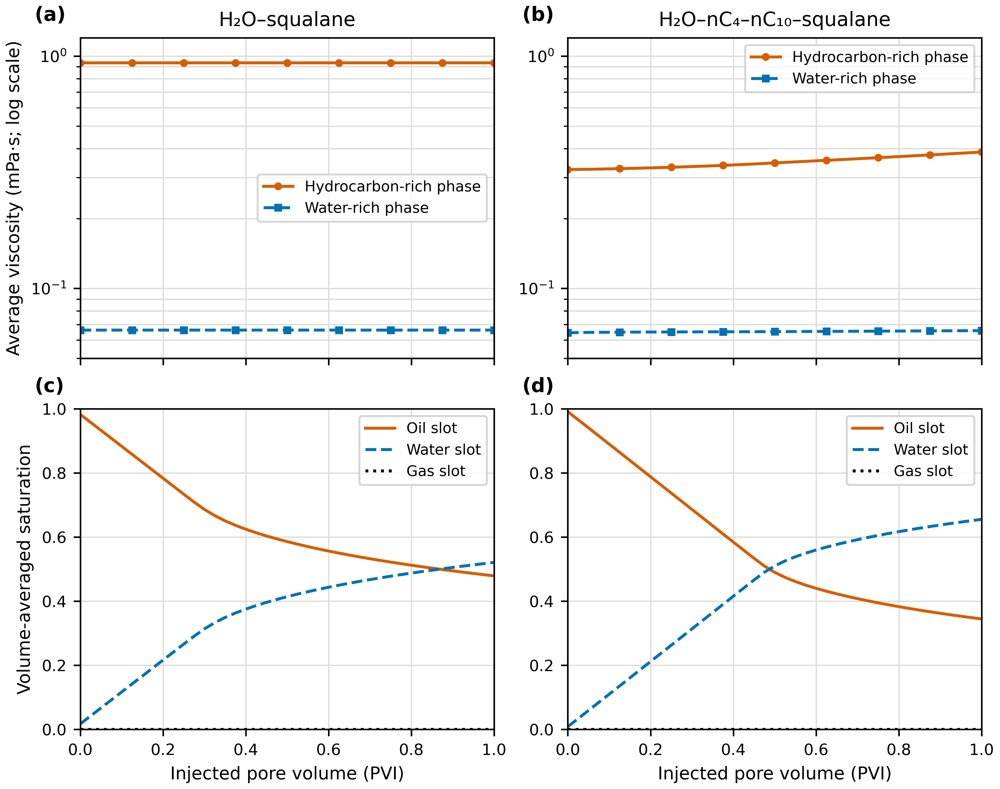
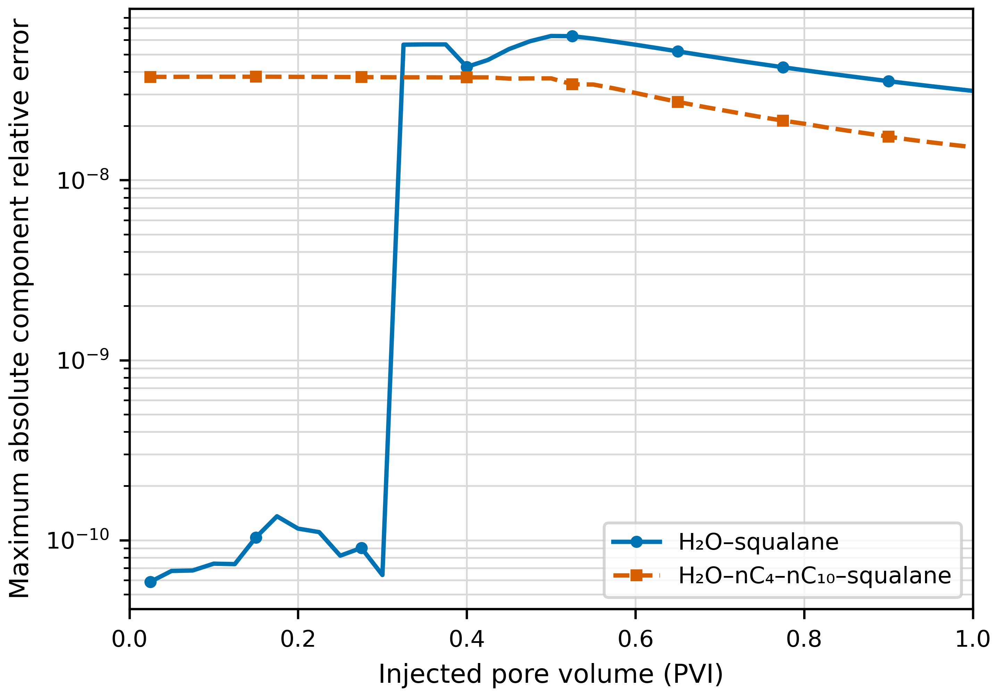

# 超临界水驱干酪根裂解产物一维算例结果报告

> 内部数值实验记录，生成日期：2026-09-16。结果来自当前 PR 算例的确定性输出；BIP、密度和黏度模型尚未完成实验标定，本文不把当前数值当作实验预测。

## 1. 摘要

本报告比较两个 60 × 1 × 1 均质一维超临界水驱算例：H2O–squalane 二元体系和 H2O–nC4–nC10–squalane 轻–中–重四组分体系。两者均在 653.2 K、27.74 MPa 初始压力、0.25 PV/d 等地层体积注采条件下推进至 4 d，即 1 PVI。[R1–R2]

主要观察如下：

- 两个算例均完整结束。二元算例接受 40 步、无拒绝步；四组分算例接受 44 个内部步、拒绝 1 步。[R1–R2]
- 以“最远一个 Sw ≥ 0.5 的网格中心”为离散水驱前缘，1 PVI 时二元前缘位于 0.53 m，四组分前缘已到达最后一个网格中心 1.19 m。[F1, T3]
- 生产井 H2O 质量分数首次达到 50% 的记录时刻分别为 0.40 PVI（二元）和 0.55 PVI（四组分）。该井口质量分数判据与 Sw ≥ 0.5 的空间前缘判据不同，不能互换。[F1–F2, T1, T3]
- 1 PVI 时，二元生产物流质量分数为 H2O 85.28%、squalane 14.72%；四组分生产物流为 H2O 86.05%、nC4 0.57%、nC10 1.67%、squalane 11.71%。[F2, T1]
- 二元烃富相平均黏度在全程基本不变，约为 0.936 mPa·s；四组分烃富相平均黏度由 0.325 增至 0.387 mPa·s，增幅约 18.9%。[F3, T2]
- 全程最大组分相对质量守恒误差分别为 6.32×10⁻⁸ 和 3.75×10⁻⁸。[F4, T4]

## 2. 模型与数据处理

### 2.1 共同设置

| 项目 | 数值 |
|---|---:|
| 网格 | 60 × 1 × 1 |
| 物理尺寸 | 1.20 m × 0.10 m × 0.10 m |
| 孔隙度 | 0.35 |
| 渗透率 | kx = ky = 1500 mD；kz = 150 mD |
| 状态方程 | Peng–Robinson |
| 温度 | 653.2 K |
| 初始压力 | 27.74 MPa |
| 注入流体 | H2O |
| 注采制度 | 等地层体积注采，0.25 PV/d |
| 总时间 | 4 d = 1 PVI |
| 输出间隔 | 0.1 d = 0.025 PVI |

### 2.2 绘图变换

图形直接读取 `solution_step_*.csv`、`well_history.csv`、`reservoir_diagnostics.csv` 和 `component_mass_balance.csv`。处理规则为：[T1–T4]

1. `PVI = time_day × 0.25 PV/d`；
2. 生产井组分质量分数为各产出组分质量流率绝对值除以全部产出组分质量流率绝对值之和；
3. 烃富相黏度为油/气相槽按相饱和度加权的体积平均值；本次完成算例的气相饱和度为零；
4. 空间曲线使用网格中心原始值，不插值、不平滑；
5. 质量守恒曲线取每个输出时刻所有组分相对误差绝对值的最大值；初始时刻的严格零误差仅从对数图中省略，仍保留在底层 CSV。

这些计算均为单次确定性模拟，没有重复样本、统计估计或不确定区间。

## 3. 水驱前缘演化

**图 1.** 沿程含水饱和度。上图为 H2O–squalane，下图为 H2O–nC4–nC10–squalane；每条线对应一个离散输出时刻。横坐标为距注入端的网格中心位置，未对离散网格值插值。[F1, T3]

用最远一个 Sw ≥ 0.5 的网格中心定义离散前缘，得到：

| PVI | 二元前缘 / m | 四组分前缘 / m |
|---:|---:|---:|
| 0.25 | 0.11 | 0.27 |
| 0.50 | 0.25 | 0.59 |
| 0.75 | 0.39 | 0.91 |
| 1.00 | 0.53 | 1.19 |

四组分体系的水饱和度前缘在相同 PVI 下推进更快，并在 1 PVI 时覆盖到生产端最后一个网格中心。当前四组分烃富相黏度显著低于纯 squalane 体系，与更高水相流动推进速度相一致；但该差异同时受相平衡、相渗和组成相关密度影响，不能仅归因于黏度。[F1, F3]

## 4. 生产井组分变化

**图 2.** 生产井总产出物流中的组分质量分数。步零井控尚未求解，因此曲线从首个已求解输出 0.025 PVI 开始。[F2, T1]

| 体系与时刻 | H2O | nC4 | nC10 | squalane |
|---|---:|---:|---:|---:|
| 二元，0.025 PVI | 10.29% | 不适用 | 不适用 | 89.71% |
| 二元，1.000 PVI | 85.28% | 不适用 | 不适用 | 14.72% |
| 四组分，0.025 PVI | 14.10% | 1.67% | 10.21% | 74.03% |
| 四组分，1.000 PVI | 86.05% | 0.57% | 1.67% | 11.71% |

二元体系在 0.30–0.40 PVI、四组分体系在 0.475–0.55 PVI 出现明显的生产井组分转折。按离散输出点判断，H2O 质量分数首次达到 50% 的时刻分别为 0.40 和 0.55 PVI。[F2, T1]

应特别注意，生产井 H2O **质量分数**达到 50%，并不表示生产井网格的 Sw 已经达到 0.5。相密度、相组成、相对渗透率和局部相平衡都会改变质量流率；因此图 1 的空间饱和度前缘与图 2 的组分突破必须作为两个不同观测量报告。

## 5. 黏度和平均饱和度

**图 3.** 上排为相体积加权平均黏度，纵坐标采用以 10 为底的对数尺度；下排为体积平均相饱和度。油、气、水为模拟器相槽名称，在超临界水条件下不应自动等同于常规油藏相态。[F3, T2]

| 体系 | 烃富相黏度：0 → 1 PVI / mPa·s | 水富相黏度：0 → 1 PVI / mPa·s | 1 PVI 平均 Sw |
|---|---:|---:|---:|
| H2O–squalane | 0.93609 → 0.93619 | 0.066172 → 0.066173 | 0.5210 |
| H2O–nC4–nC10–squalane | 0.32528 → 0.38664 | 0.064455 → 0.065818 | 0.6554 |

二元烃富相黏度变化仅约 0.01%，而四组分烃富相黏度增加约 18.9%。四组分水富相黏度增加约 2.1%。这是当前关联式对局部相组成演化的响应；尚未使用高温高压混合物黏度数据标定，不能据此宣称真实体系具有相同的变化幅度。

## 6. 质量守恒和数值完成性

**图 4.** 每个输出时刻的最大组分相对质量守恒误差绝对值。严格为零的初始值不显示在对数轴，但保留在源数据中。[F4, T4]

| 指标 | 二元 | 四组分 |
|---|---:|---:|
| 最终时间 | 4 d | 4 d |
| 最终注入量 | 1 PVI | 1 PVI |
| 接受内部步 | 40 | 44 |
| 拒绝内部步 | 0 | 1 |
| 最小接受时间步 | 0.1 d | 0.00234375 d |
| 全程最大组分相对误差 | 6.32×10⁻⁸ | 3.75×10⁻⁸ |

四组分算例在相态/组分转折附近需要一次时间步缩小，但最终完整推进，守恒误差没有随 1 PVI 注入出现累积放大。[R2, F4]

## 7. 物理解读与实验设计意义

当前一维结果适合用作二维实验前的机制筛选：

1. **单重组分基线清楚。** 二元体系的烃富相黏度几乎不变，生产井转折主要反映水驱前缘和相对渗透率变化，适合作为 EOS/BIP 与流动耦合的基准。
2. **加入轻、中组分后出现组成–黏度耦合。** 四组分烃富相黏度随驱替升高，生产井 nC4、nC10 和 squalane 的相对产出同时变化，能观察更明显的组分分馏信号。
3. **空间前缘与井口突破应分别校准。** 前者受饱和度分布控制，后者是质量流率、密度、相组成和相对渗透率共同作用的结果。
4. **一维与二维具有不同用途。** 一维算例便于标定和机制归因；二维点井算例还会叠加横向展布、井附近径向流和网格方向性，不应期待相同突破时刻。

## 8. 局限性

- 当前只报告 PR 基准，没有形成 PR/SW/CPA 的一维模型差异带。
- H2O–nC4、H2O–nC10 和 H2O–squalane BIP 尚未按目标温压实验数据统一回归。
- 黏度和密度关联式尚未用高温高压纯组分与混合物数据标定。
- 本次为单网格、单参数集的确定性计算，没有网格收敛、参数不确定性或实验误差传播。
- 1D 均质模型不包含横向流、非均质性、重力超覆和井附近二维效应。
- 图中“油相/气相/水相槽”是求解器内部相角色；在 653.2 K 超临界水条件下，最终相态名称必须结合相组成和密度判断。

因此，当前最可靠的结论是“程序能够产生守恒良好且可分辨的前缘、黏度和井口组分信号”，而不是“这些曲线已经预测了真实裂解产物体系”。

## 9. 证据与交付文件

| ID | 内容 | 路径 |
|---|---|---|
| R1 | 二元一维原始结果 | `case/scw_kerogen_squalane_1d/results/base/` |
| R2 | 四组分一维原始结果 | `case/scw_kerogen_lmh_1d/results/base/` |
| F1 | 沿程含水饱和度图 | `docs/figures/scw_kerogen_1d_20260916/fig01_spatial_water_saturation.{png,pdf,svg}` |
| F2 | 生产井组分图 | `docs/figures/scw_kerogen_1d_20260916/fig02_producer_composition.{png,pdf,svg}` |
| F3 | 黏度与平均饱和度图 | `docs/figures/scw_kerogen_1d_20260916/fig03_viscosity_and_saturation.{png,pdf,svg}` |
| F4 | 质量守恒图 | `docs/figures/scw_kerogen_1d_20260916/fig04_component_mass_balance.{png,pdf,svg}` |
| T1 | 生产井组分长表 | `docs/figures/scw_kerogen_1d_20260916/producer_composition_long.csv` |
| T2 | 黏度与饱和度长表 | `docs/figures/scw_kerogen_1d_20260916/viscosity_saturation_long.csv` |
| T3 | 空间饱和度长表 | `docs/figures/scw_kerogen_1d_20260916/spatial_saturation_long.csv` |
| T4 | 质量守恒长表 | `docs/figures/scw_kerogen_1d_20260916/mass_balance_max_long.csv` |

绘图脚本为 `case/scw_kerogen_common/plot_1d_comparison.py`；变换记录、软件版本和图形替代文本见 `docs/figures/scw_kerogen_1d_20260916/figure_manifest.json`。PNG 为 RGB 白底、600 dpi；PDF 和 SVG 为矢量版本。颜色同时配有不同线型、标记或分面；调色板检查显示所有前景色对白底达到 3:1，但部分颜色对的灰度亮度差较小，因此不能仅依赖颜色区分。

本报告和图件仍需研究者对照原始 CSV 与物性输入进行最终科学复核。
