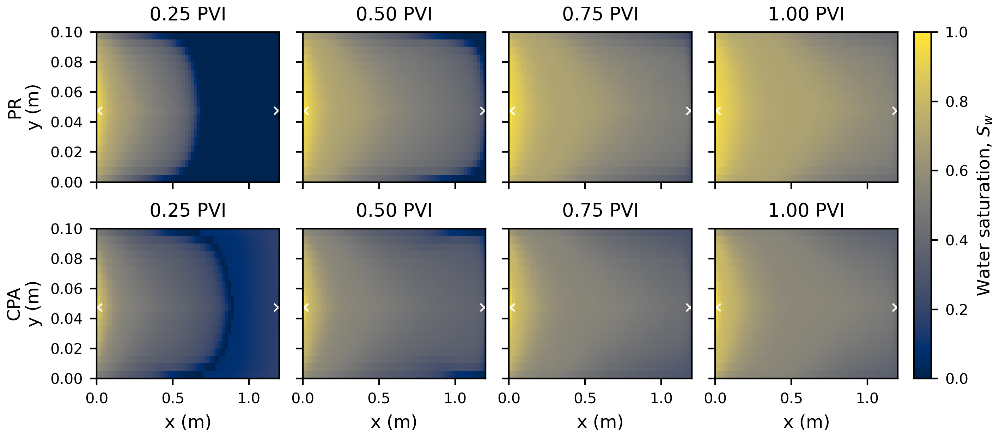
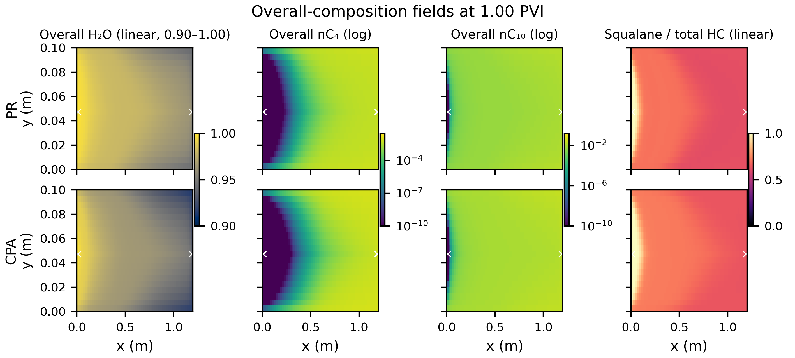
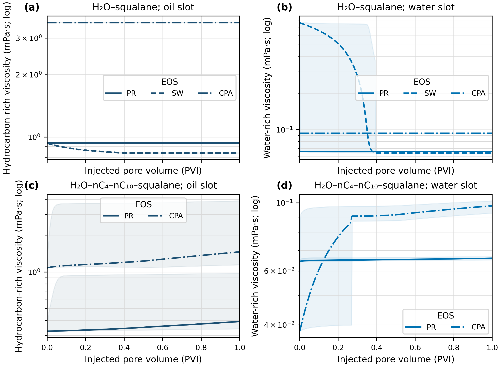
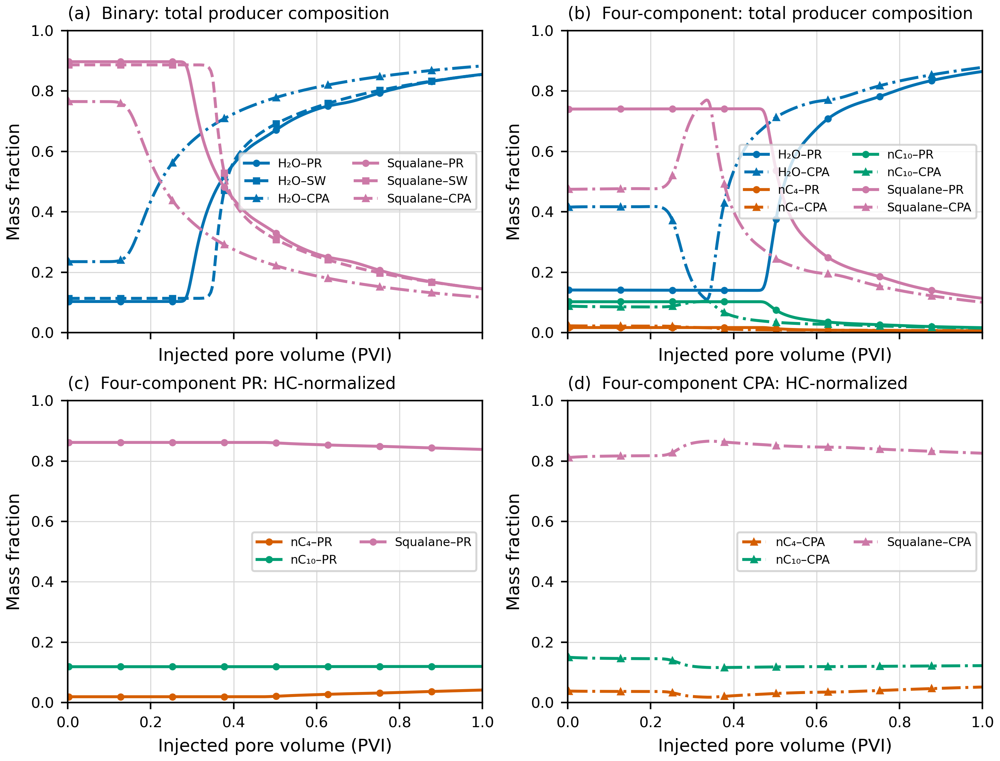
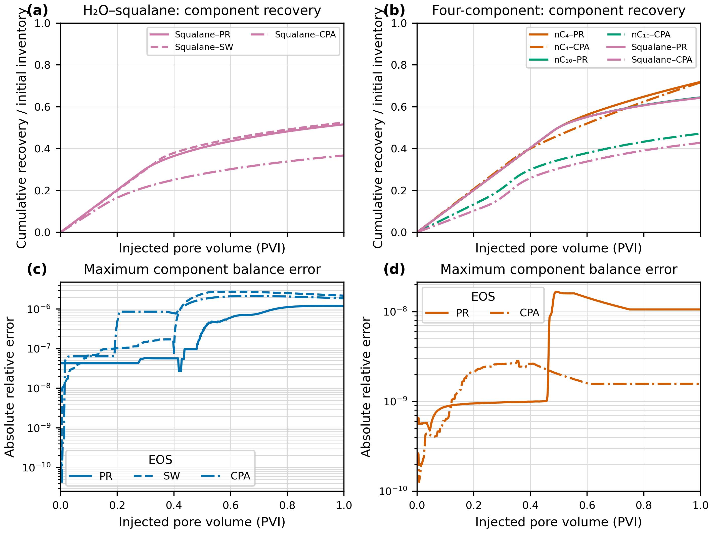
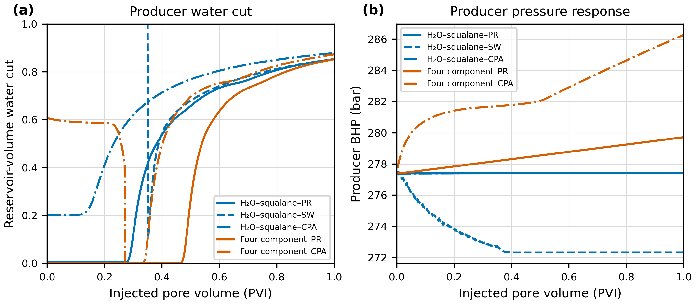

# 超临界水驱干酪根裂解产物图册

> 基于当前二元 H2O–squalane 和四组分 H2O–nC4–nC10–squalane 算例。本文展示的是确定性计算结果；物性尚未完成统一标定，EOS 差异是模型差异，不是统计置信区间。

## 图 1：PVT、相平衡与黏度标定状态

图中实验点与当前/拟合模型直接对照。密度体积平移已有改善，但当前 LBC 黏度回归残差仍很大；共存组成拟合虽然改善 squalane 富相 H2O 含量，水富相端点和逸度残差仍需进一步检查。因此后续流动图适合观察程序响应和相对趋势，暂不宜作为定量实验预测。

## 图 2：二维水驱前缘

四个时刻和两个 EOS 使用同一 0–1 色标，白色叉号为注采井位置。该图回答超临界水如何从短边中央向生产端展开，以及 PR/CPA 是否给出不同的横向展布和突破进程。四组分 SW 未完成流动计算，因此没有把不完整结果与完成结果并列。

## 图 3：1 PVI 时二维总体组成

H2O 和 squalane/总烃采用线性色标；跨多个数量级的 nC4、nC10 采用明确标注的对数色标。每一列的 PR/CPA 使用完全相同的范围，可以直接比较模型差异。该图显示轻组分在水扫区显著衰减，并保留了注采几何造成的二维分布。

## 图 4：油水黏度随 PVI 的模型差异

实线、虚线和点划线分别表示 PR、SW 和 CPA。中心线是全网格平均黏度，浅色带是同一时刻网格单元的最小–最大范围；它是**空间范围，不是不确定性区间**。当前快照没有保存逐网格黏度，因此不能生成局部黏度色彩图。

## 图 5：生产井总组成和烃归一化组成

上排包含 H2O，直接反映见水和总产出物流变化；下排从分母中去掉 H2O，使 nC4、nC10、squalane 的烃内部分馏不会被高含水率压缩。组分用颜色区分，EOS 同时用线型和标记区分。

## 图 6：累计组分采收率与质量守恒

累计组分采收率定义为累计产出质量除以该组分初始库存。下排为每一输出时刻所有组分相对守恒误差绝对值的最大值；严格为零的初始点只从对数图中省略，原始长表仍保留。

## 图 7：生产井含水率和压力响应

左图采用地层体积含水率，不能与地面含水率混用。二元 SW 的初始全水相表现和四组分 CPA 的高初始含水率均清楚可见，说明不同 EOS 的初始闪蒸状态尚未统一；这些早期差异目前应视为诊断信号，而不是可信突破预测。

## 文件和可重复性

所有图均同时提供 PNG、PDF 和 SVG：

- `docs/figures/scw_kerogen_flow_objective_20260916/`
- PNG 为 RGB 白底、400 dpi；PDF/SVG 为矢量版本。
- 绘图脚本：`case/scw_kerogen_common/plot_flow_objective_figures.py`
- 数据变换和限制：`docs/figures/scw_kerogen_flow_objective_20260916/figure_manifest.json`

同时保存以下底层长表：

- `viscosity_envelope_long.csv`
- `producer_composition_long.csv`
- `recovery_balance_long.csv`
- `producer_watercut_long.csv`

尚不能从当前结果生成的图件有两项：

1. **逐网格油相/水相黏度色彩图**：当前场快照未保存局部黏度；
2. **四组分 SW 完整流动曲线**：该算例在初始相态切换附近失败，没有可与 PR/CPA 等价比较的完整 1 PVI 结果。

下一轮若在输出中增加每个网格的 `mu_o`、`mu_w`、`rho_o`、`rho_w`、相对渗透率和相流度，即可补充真正的局部黏度场与流度比图。
