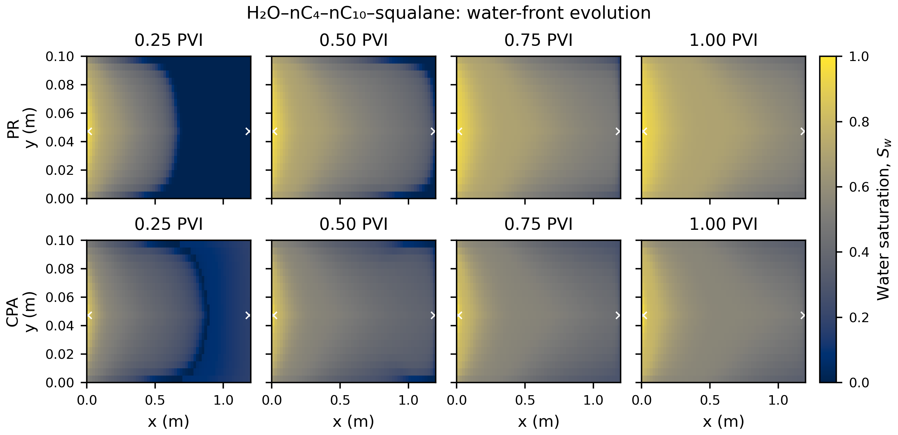
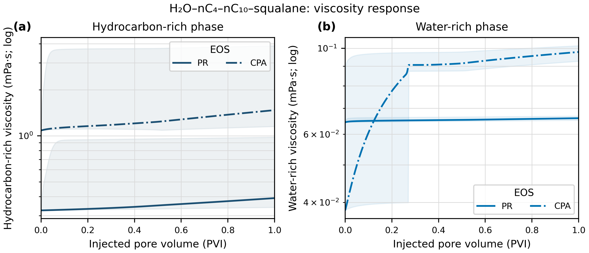
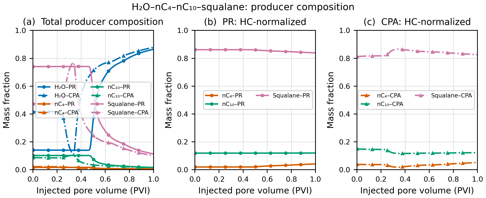
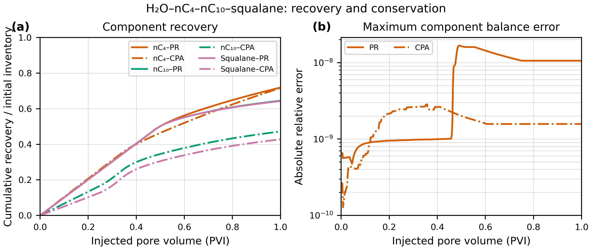
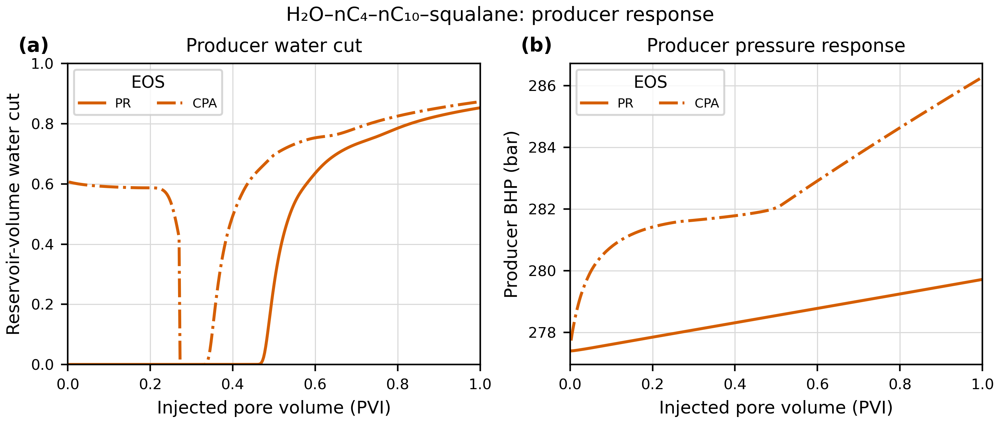

# 超临界水驱多组分裂解产物图册

> 体系：H₂O–nC₄–nC₁₀–squalane。nC₄、nC₁₀ 和 squalane 分别代表轻、中、重烃组分。图中为当前 PR 与 CPA 完整算例结果；SW 算例未完成 1 PVI，未插值或补造曲线。

## 图 1：二维含水饱和度前缘

PR 与 CPA 分行展示，0.25、0.50、0.75、1.00 PVI 统一使用 0–1 色标，用于比较水前缘推进、横向展布和突破进程。

## 图 2：1 PVI 时总体组分分布

H₂O 与 squalane/总烃使用线性色标；跨多个数量级的 nC₄ 和 nC₁₀ 使用明确标注的对数色标。每一列的 PR/CPA 色标完全一致，可直接比较模型差异。

## 图 3：油富相与水富相黏度

中心线是全网格平均黏度，浅色范围是网格最小–最大值，表示空间范围而非统计不确定性。由于当前快照不含逐网格黏度，尚不能生成局部黏度色彩图。

## 图 4：生产井总组成与烃内部分馏

左图包含 H₂O，回答何时见水以及总产出物如何变化；中、右图从分母中剔除 H₂O，分别展示 PR 和 CPA 下 nC₄、nC₁₀、squalane 的烃内部分馏，避免高含水率压缩烃组分差异。

## 图 5：轻、中、重组分采收率与质量守恒

累计组分采收率分别以该组分初始库存归一化。右图给出每个输出时刻的最大组分相对守恒误差。

## 图 6：生产井含水率与压力响应

左图为地层体积含水率，右图为生产井井底压力。CPA 的高初始含水率说明 PR/CPA 初始闪蒸状态尚未完全统一；早期差异应先作为模型诊断，而不是可信的 EOS 预测带。

## 数据与可重复性

- 图件目录：`docs/figures/scw_kerogen_flow_separated_20260916/multicomponent/`
- 每张图均提供 PNG、PDF、SVG。
- PNG 为 RGB 白底、400 dpi。
- 同目录保存黏度、生产井组成、采收率/守恒、含水率的长表 CSV。
- 数据来源、变换规则和当前限制记录在 `figure_manifest.json`。
- 四组分 SW 未完成初始相态切换，因此本图册仅包含完成的 PR 与 CPA 结果。

