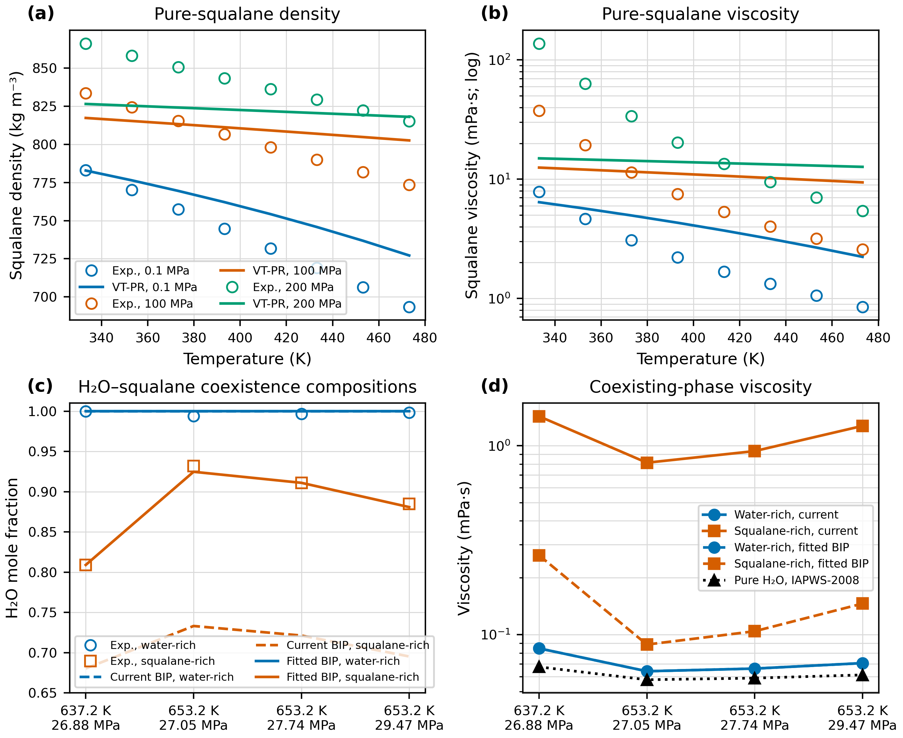
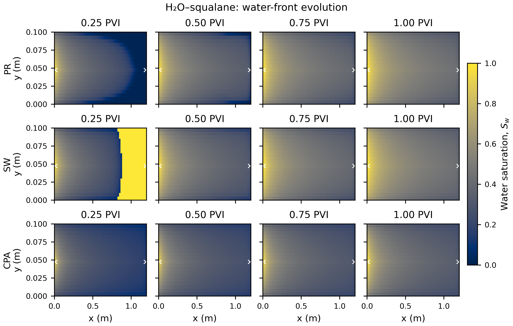
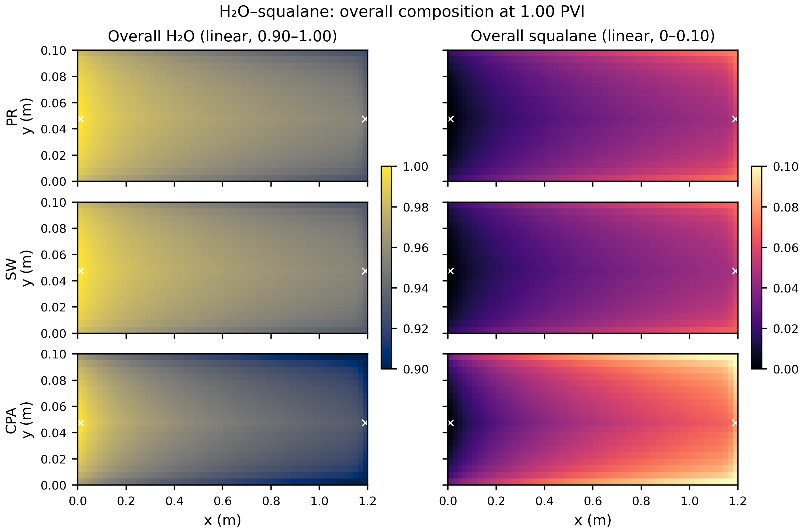
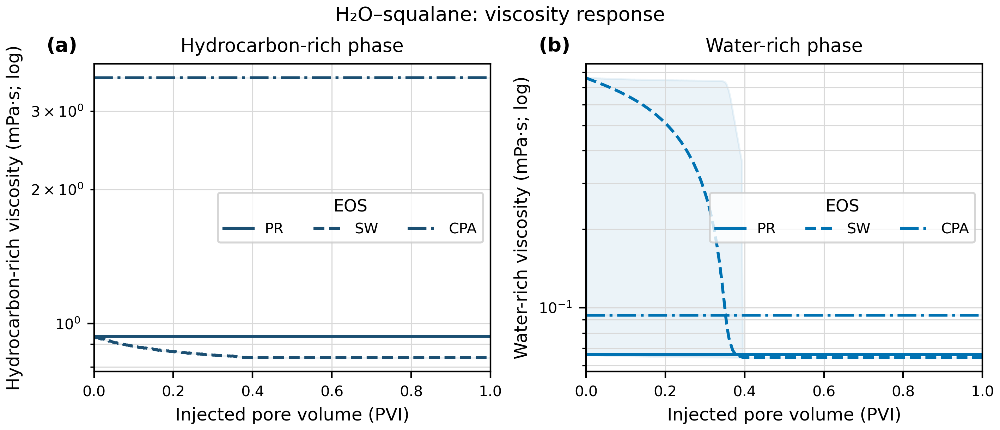
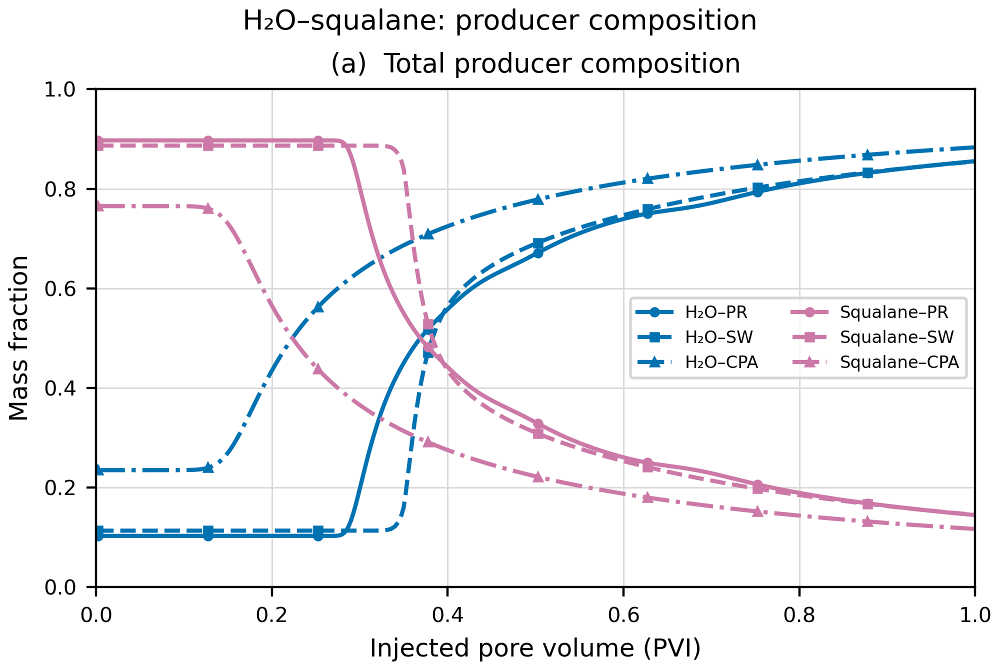
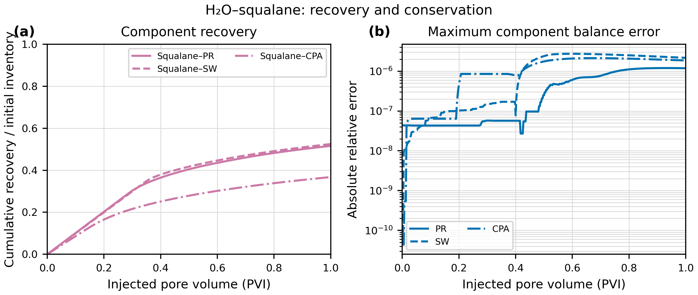
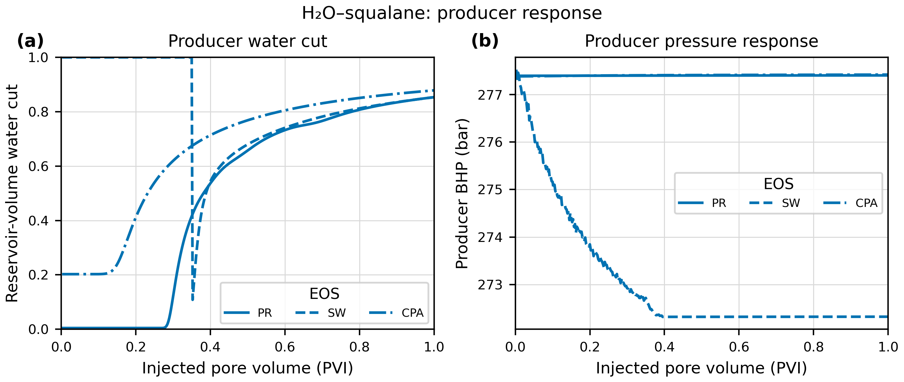

# 超临界水驱单重油组分图册

> 体系：H₂O–squalane。这里的“单组分”指烃相只用 squalane 一个重油代表组分；计入注入水后，热力学体系仍是二元体系。图中均为当前确定性算例结果，物性标定尚未完成。

## 图 1：单组分体系的 PVT、相平衡与黏度标定

本图只服务于 H₂O–squalane 体系。当前密度校正优于黏度校正；LBC 黏度回归误差仍大，因此后续黏度曲线适合比较程序响应和 EOS 差异，不宜直接作为定量实验预测。

## 图 2：二维含水饱和度前缘

PR、SW、CPA 分行展示，四个时刻统一使用 0–1 色标。SW 在 0.25 PVI 的右侧全水区源于其异常初始闪蒸状态，是需要修正的模型诊断信号，而不是可信的水驱前缘。

## 图 3：1 PVI 时总体组成

两列分别为总体 H₂O 和总体 squalane。为显示空间差异，H₂O 色标固定为 0.90–1.00，squalane 色标固定为 0–0.10；三个 EOS 使用完全相同的色标，未对单个面板自动拉伸。

## 图 4：油富相与水富相黏度

中心线为全网格平均黏度，浅色范围为同一时刻所有网格的最小–最大值，是空间离散范围，不是统计置信区间。当前输出未保存逐网格黏度，因而不能绘制局部黏度场。

## 图 5：生产井产出组成

图中只包含 H₂O 与 squalane，总质量分数直接展示见水过程。颜色区分组分，线型与标记区分 EOS。

## 图 6：squalane 采收率与质量守恒

累计采收率定义为累计产出 squalane 质量除以初始 squalane 库存。右图是每个输出时刻各组分相对守恒误差绝对值的最大值。

## 图 7：生产井含水率与压力响应

左图为地层体积含水率，右图为生产井井底压力。SW 的早期异常与图 2 中的初始全水状态一致，应作为初始化问题处理。

## 数据与可重复性

- 图件目录：`docs/figures/scw_kerogen_flow_separated_20260916/single_component/`
- 每张图均提供 PNG、PDF、SVG。
- PNG 为 RGB 白底、400 dpi。
- 同目录保存黏度、生产井组成、采收率/守恒、含水率的长表 CSV。
- 数据来源、变换规则和当前限制记录在 `figure_manifest.json`。

